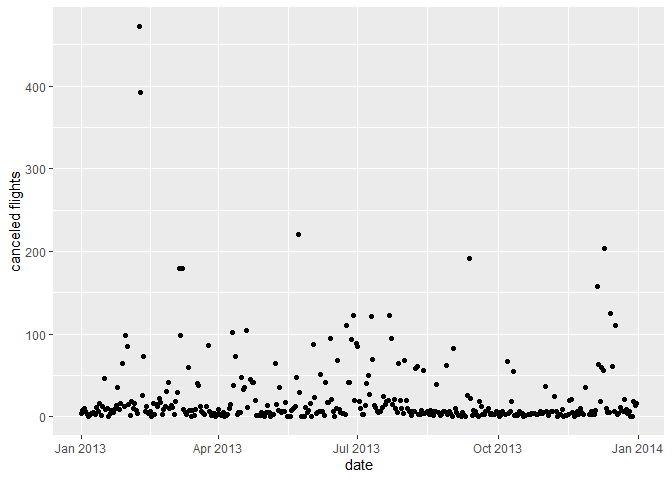
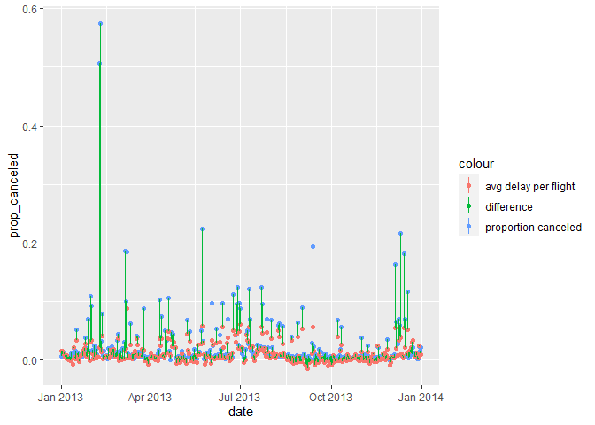

Homework 2
================
Robert George
9/23/2021

\#\#\#Homework 1 \#\#Robert George

``` r
library(tidyverse)
```

    ## -- Attaching packages --------------------------------------- tidyverse 1.3.1 --

    ## v ggplot2 3.3.5     v purrr   0.3.4
    ## v tibble  3.1.4     v dplyr   1.0.7
    ## v tidyr   1.1.3     v stringr 1.4.0
    ## v readr   2.0.1     v forcats 0.5.1

    ## -- Conflicts ------------------------------------------ tidyverse_conflicts() --
    ## x dplyr::filter() masks stats::filter()
    ## x dplyr::lag()    masks stats::lag()

``` r
library(dplyr)
library(nycflights13)
library(ggplot2)
```

\#How many flights have a missing dep\_time?

``` r
flights = flights
flights%>%
  summarize(sum(is.na(dep_time)))
```

    ## # A tibble: 1 x 1
    ##   `sum(is.na(dep_time))`
    ##                    <int>
    ## 1                   8255

\#What other variables are missing? What might these rows represent?

``` r
flights%>%
  filter(is.na(dep_time))
```

    ## # A tibble: 8,255 x 19
    ##     year month   day dep_time sched_dep_time dep_delay arr_time sched_arr_time
    ##    <int> <int> <int>    <int>          <int>     <dbl>    <int>          <int>
    ##  1  2013     1     1       NA           1630        NA       NA           1815
    ##  2  2013     1     1       NA           1935        NA       NA           2240
    ##  3  2013     1     1       NA           1500        NA       NA           1825
    ##  4  2013     1     1       NA            600        NA       NA            901
    ##  5  2013     1     2       NA           1540        NA       NA           1747
    ##  6  2013     1     2       NA           1620        NA       NA           1746
    ##  7  2013     1     2       NA           1355        NA       NA           1459
    ##  8  2013     1     2       NA           1420        NA       NA           1644
    ##  9  2013     1     2       NA           1321        NA       NA           1536
    ## 10  2013     1     2       NA           1545        NA       NA           1910
    ## # ... with 8,245 more rows, and 11 more variables: arr_delay <dbl>,
    ## #   carrier <chr>, flight <int>, tailnum <chr>, origin <chr>, dest <chr>,
    ## #   air_time <dbl>, distance <dbl>, hour <dbl>, minute <dbl>, time_hour <dttm>

In rows where dep\_time is missing, dep\_delay, arr\_time, arr\_delay,
and air\_time are also missing. These rows represent cancelled flights.

\#Currently dep\_time and sched\_dep\_time are convenient to look at,
but hard to compute with because they’re not really continuous numbers.
Convert them to a more convenient representation of number of minutes
since midnight.

``` r
library(lubridate)
```

    ## 
    ## Attaching package: 'lubridate'

    ## The following objects are masked from 'package:base':
    ## 
    ##     date, intersect, setdiff, union

``` r
lubri_flights = flights%>%
  mutate(dep_time =((dep_time %/% 100)*60) + (dep_time %% 100),
         sched_dep_time =  hour*60 + minute)
```

\#Look at the number of canceled flights per day. Is there a pattern?

``` r
flights%>%
  filter(is.na(dep_time))%>%
  group_by(month, day, year)%>%
  summarize(`canceled flights` = n(),
            date = make_date(year,month,day))%>%
  ggplot(aes(x = date, y = `canceled flights`))+
  geom_point()
```

    ## `summarise()` has grouped output by 'month', 'day', 'year'. You can override using the `.groups` argument.

<!-- --> There does
not appear to be a pattern.Even if zoomed in by filtering out days with
more than 100 missed flights, there does not seem to be any sort of
pattern to the data.

\#Is the proportion of canceled flights related to the average delay?
Use multiple dyplr operations, all on one line, concluding with
ggplot(aes(x= ,y=)) + geom\_point()

``` r
flights%>%
  group_by(month, day, year)%>%
  summarize(date = make_date(year,month,day),
            canceled = sum(is.na(dep_time)),
            flights = n(),
            prop_canceled = sum(is.na(dep_time))/flights,
            avg_delay = ((mean(dep_delay, na.rm=TRUE)+mean(arr_delay, na.rm=TRUE))/2)/flights)%>%
  ggplot(aes(x = date))+
  geom_point(aes(y =prop_canceled, color = "proportion canceled"))+
  geom_point(aes(y = avg_delay, color = "avg delay per flight"))+
  geom_linerange(aes(x=date, ymin=prop_canceled, ymax=avg_delay, colour="difference"))
```

    ## `summarise()` has grouped output by 'month', 'day', 'year'. You can override using the `.groups` argument.

<!-- --> It seems that
there is a slight affinity between the proportion of canceled flights
per day and the average delay per flight per day. The difference lines
indicate that at dates with large proportions of canceled flights, there
tends to be greater delay per flight.
